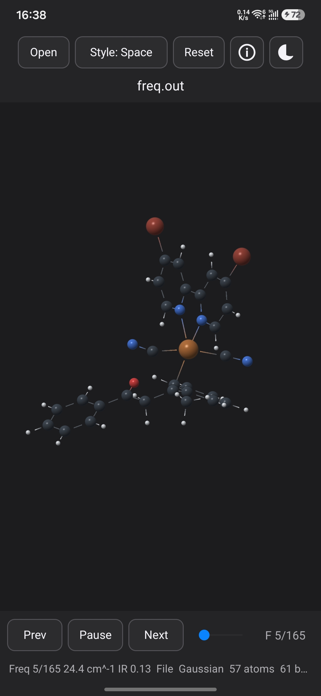

# XYZShow



XYZShow is a small native Android molecular viewer for local XYZ files and Gaussian frequency outputs.

## Features

- Open local `.xyz`, multi-frame `.xyz`, Gaussian `.out`, and Gaussian `.log` files.
- Render molecules with OpenGL ES 2.0.
- Switch between `Space` and `Stick` styles.
- Toggle black/white backgrounds.
- Reset the camera when the molecule is dragged out of view.
- For Gaussian frequency jobs, inspect modes with `Prev` / `Next` and animate the selected normal mode with `Play`.
- Use the `Info` button to show XYZ title details or Gaussian output metadata.

## Gaussian Output Support

The parser reads text Gaussian `.out` / `.log` files and extracts:

- last `Standard orientation` block, falling back to last `Input orientation`
- harmonic `Frequencies --` blocks
- reduced masses, force constants, IR intensities, and normal-mode displacement vectors
- termination state, route section, charge/multiplicity, last SCF energy, ZPE, frequency count, imaginary-mode count, and lowest frequency

This is visualization only. XYZShow does not validate whether a calculation is a real minimum, transition state, or IRC-confirmed result.

## Build

Requirements:

- Android SDK with build tools
- Gradle 8.9 or compatible
- JDK 17 or newer

Build and verify the debug APK:

```bash
export ANDROID_HOME=/path/to/android/sdk
gradle assembleDebug
```

Or use the helper script:

```bash
export ANDROID_HOME=/path/to/android/sdk
./build_debug_apk.sh
```

The latest prebuilt debug APK from this snapshot is included at:

```text
releases/XYZShow-debug-0.3.9.apk
```

## Scope

Current version: `0.3.9`.

PDB, mmCIF, checkpoint files, formatted checkpoint files, cube/volume data, cloud sync, and Play Store release packaging are not included in this snapshot.
